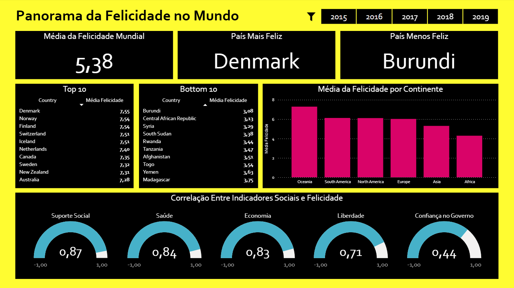

# Panorama da Felicidade no Mundo

## Base de Dados
- **Descrição:** Relatório anual produzido por pesquisadores e instituições sobre o panorama da felicidade no mundo
- **Fonte:** Kaggle
- **Ferramenta:** Power BI

World Happiness Report é uma grande pesquisa global que entrevista pessoas em mais de 160 países. A pesquisa é baseada na resposta da pergunta: "Imagine uma escada de 0 a 10 onde 10 é a melhor vida possível e 0 a pior. Onde você está hoje?"

A partir daí é calculado um **Happiness Score**.

A metodologia é consistente: mesmos questionários, mesmos métodos de coleta e amostras representativas por país. Isso permite comparar países ao longo do tempo.

## Objetivo do projeto
Analisar como a felicidade está distribuída entre diferentes países e continentes e investigar quais fatores apresentam maior relação com o Happiness Score.

## Limitações
A felicidade é subjetiva. Isso significa que diversos fatores que não estão no modelo, também podem influenciar as respostas. Como: cultura, desigualdade, desemprego, educação, religião, etc.

## Estrutura
- data
    - 2015.csv
    - 2016.csv
    - 2017.csv
    - 2018.csv
    - 2019.csv
- figures
    - dashboard.png
- analysis.pbix

## Variáveis
1. Country

Tipo: texto
Nome do país analisado.

2. Region

Tipo: texto
Região geográfica do país.

### Métricas principais:
3. Happiness Rank

Tipo: número inteiro
Ranking dos países baseado no Happiness Score.

4. Happiness Score

Tipo: número decimal
Representa o nível médio de felicidade da população de um país.

### Fatores Explicativos
*Essas variáveis tentam explicar por que alguns países são mais felizes que outros. Elas são normalizadas e usadas em modelos estatísticos (regressão). Portanto, essas colunas não são valores brutos.*

5. Economy (GDP per Capita)

Tipo: decimal
Representa a riqueza média do país por pessoa.

6. Social Support

Tipo: decimal
Mede apoio social percebido.

7. Health (Life Expectancy)

Tipo: decimal
Representa a expectativa de vida saudável da população.

8. Freedom

Tipo: decimal
Mede a liberdade percebida para tomar decisões na vida.

9. Trust (Government Corruption)

Tipo: decimal
Mede a percepção de corrupção no governo e nas instituições.

*Cada variável contribui com uma parcela da felicidade média do país.*

## Limpeza e Preparação dos Dados
1) Importar como "pasta" para o Power BI

2) Editar cada arquivo (padronização de nome das colunas e excluir colunas inúteis para análise)

3) Juntar arquivos

4) Criar tabelas novas com: Country, Region e Continent (a partir de tabela auxiliar da internet)

5) Editar coluna Country (remover espaços antes e depois, e colocar cada palavra com letra maiúscula)

6) Remover duplicadas

## Dashboard
1. KPIs 

Média de Felicidade Mundial (0-10), País Mais Feliz, País Menos Feliz

2. Filtro

Anos (2015, 2016, 2017, 2018, 2019)

3. Matrizes 

Top 10 (média), Bottom 10 (média)

4. Gráfico de Barra

Média de Felicidade por Continente

5. Correlação

Correlação entre fatores explicativos e Happiness Score

*A correlação é calculada com base nos países selecionados. Os resultados podem ser instáveis quando o número de países é muito pequeno.*

## Insights

- O país com maior média de felicidade entre 2015 e 2019 é a **Dinamarca**, seguido por outros países nórdicos, como **Noruega** e **Finlândia**.

- O país com menor média de felicidade no período analisado é **Burundi**.

- O continente com a menor média de felicidade é a **África**.

- **Oceania** apresenta a maior média de felicidade. No entanto, esse resultado deve ser interpretado com cautela, pois o continente possui apenas dois países na base (**Austrália** e **Nova Zelândia**). A **América do Sul** aparece logo em seguida.

- Os fatores que apresentam maior correlação com o nível de felicidade são **suporte social**, **saúde** e **economia**.

- A variável **confiança no governo** apresenta uma correlação significativamente menor com o nível de felicidade quando comparada aos demais fatores.

